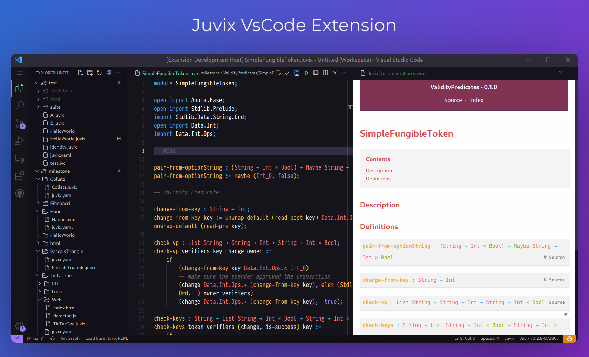

# Juvix Plugin for VSCode

This extension provides support for the Juvix programming language.

  

## Checklist

- [ ] commands/tasks for:
  - [ ] typecheck
  - [ ] compile
  - [ ] html
- problem matchers provider
  - [ ] compiler errors
- [x] semantic syntax highlighting
- [x] snippets
- [x] go to definition (not for stdlib symbols)
- [ ] go to implementation
- [ ] find all references
- [ ] types on hover
- [ ] documentation hover
- [ ] show name ids
- [ ] highlight related
- [ ] code completion
- [ ] workspace symbol search
- [ ] for debugging: show ast (run juvix internal parse)
- [ ] hints for types and parameter names

## Quick start

Install [juvix](https://docs.juvix.org) and install the [vscode-juvix](https://github.com/anoma/vscode-juvix) extension.

## Configuration

This extension provides configurations using the VSCode's configuration UI settings.
